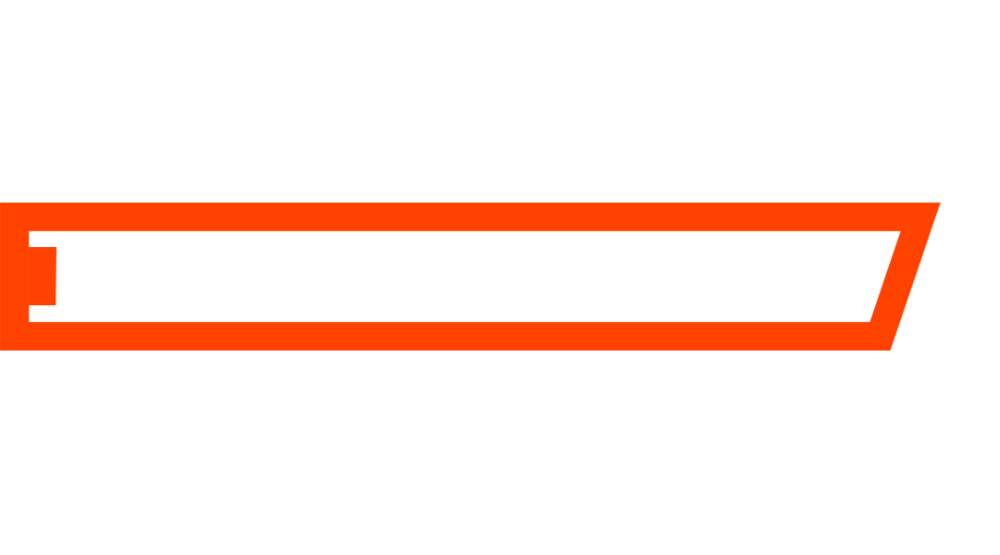

  

<h1 align="center">
  
</h1>

  Full Stack Developer focused on product-minded web experiences, scalable frontend architecture, and reliable backend services.

  Building with React, Next.js, Node.js, TypeScript, and modern UI systems.

  

## About Me

I build web products with a strong frontend eye and a practical backend mindset.
I enjoy turning complex flows into interfaces that are easier to use, maintain, and ship.

## Main Stack

  

  
  
  
  
  
  
  
  
  
  
  
  
  

## Stats

  

  
  
  

  

  

